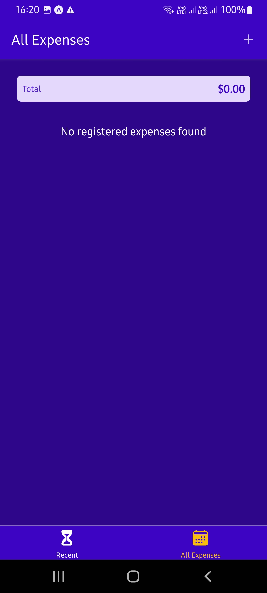
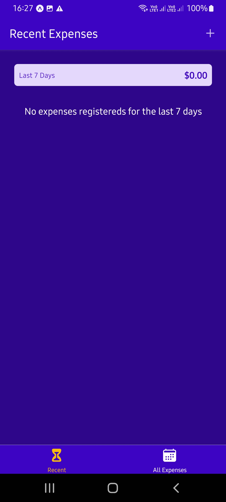
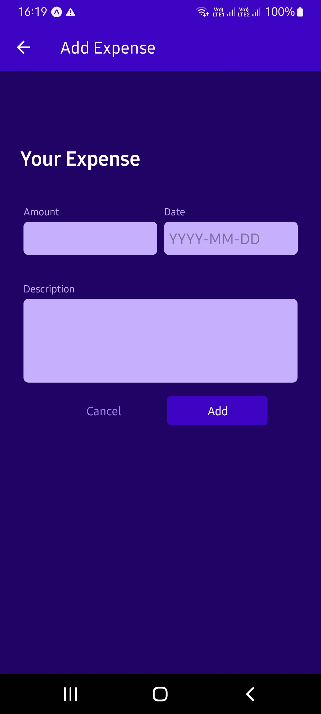
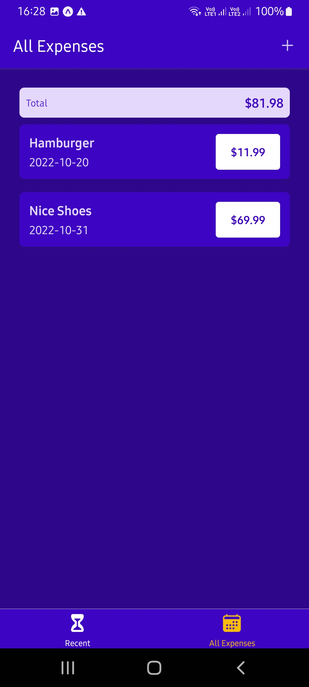
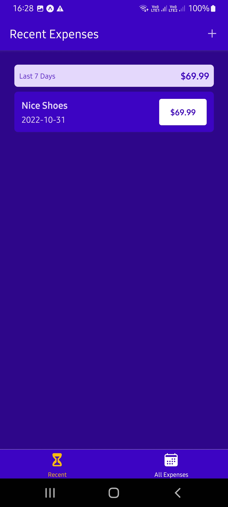
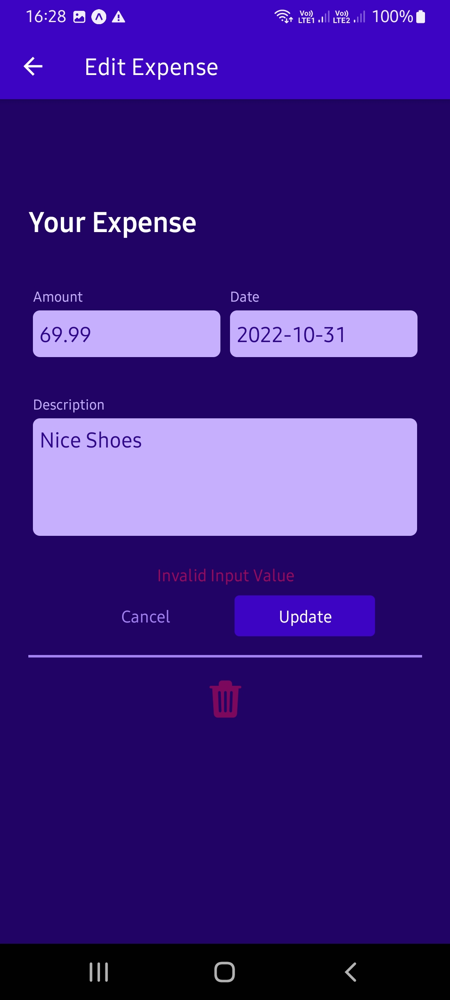

# Expenses Tracker App

Hello there.
This is a simple Expenses tracker App developed in react native.
This app it is being developed according to the classes of:

React Native - The Practical Guide [2022];

### Setup

Clone it in your machine:
```bash
git clone https://github.com/RodrigoNP3/Expense_tracker_rn.git
```

### Navigation


<table>
<thead>
<tr>
<th align="center">All Expenses</th>
<th align="center">Recent Expenses</th>
<th align="center">Add Expense</th>


</tr>
</thead>
<tbody>
<tr>
  
<td align="center">
  <a target="_blank" rel="" href="images/all_expenses.jpg">
        

  </a></td>
  
<td align="center">
  <a target="_blank" rel="" href="images/recent_expenses.jpg">
        

  </a></td>
  
 <td align="center">
  <a target="_blank" rel="" href="images/add_expense.jpg">
        

  </a></td>


  

<table>
<thead>
<tr>
<th align="center">All Expenses</th>
<th align="center">Recent Expenses</th>
<th align="center">Edit Expense</th>


</tr>
</thead>
<tbody>
<tr>
  
<td align="center">
  <a target="_blank" rel="" href="images/all_expenses_2.jpg">
        

  </a></td>
  
<td align="center">
  <a target="_blank" rel="" href="images/recent_expenses_2.jpg">
        

  </a></td>
  
 <td align="center">
  <a target="_blank" rel="" href="images/edit_expense.jpg">
        

  </a></td>

